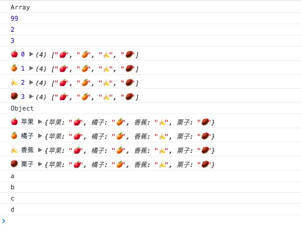

简介：

*each* `_.each(obj, iteratee, [context])` Alias: *forEach*
遍历obj中的所有元素，按顺序用遍历输出每个元素。如果传递了context参数，则把iteratee绑定到context对象上。每次调用iteratee都会传递三个参数：`(element, index, obj)`。如果obj是个JavaScript对象，iteratee的参数是 `(value, key, obj))`。返回obj以方便链式调用。（如果存在原生的forEach方法，Underscore就使用它代替。）

from：[@愚人码头](http://www.css88.com/doc/underscore1.8.2/#each)

(略有修改)

源码：

```js
    // The cornerstone, an `each` implementation, aka `forEach`.
    // Handles raw objects in addition to array-likes. Treats all
    // sparse array-likes as if they were dense.
    _.each = _.forEach = function(obj, iteratee, context) {
      iteratee = optimizeCb(iteratee, context);
      var i, length;
      if (isArrayLike(obj)) {
        for (i = 0, length = obj.length; i < length; i++) {
          iteratee(obj[i], i, obj);
        }
      } else {
        var keys = _.keys(obj);
        for (i = 0, length = keys.length; i < length; i++) {
          iteratee(obj[keys[i]], keys[i], obj);
        }
      }
      return obj;
    };

```


使用：

```js
(function(){
    console.log('Array');
    _.each([99, 2, 3], (i) => {
        console.log(i);
    });

    _.each(['🍎', '🍊', '🍌', '🌰'], (val,index,obj) => {
        console.log(val,index,obj);
    });

    console.log("Object");
    _.each({'苹果':'🍎','橘子':'🍊','香蕉':'🍌','栗子':'🌰'},(val,key,obj) => {
        console.log(val,key,obj);
    })

    _.forEach(['a','b','c','d'],(i) => {
        console.log(i);
    })

})()

```

result:




方法分析：

`isArrayLike` 判断传进来的obj是不是数组，判断数组的方法。原理就是通过判断它是否具有长度且长度大于0且小于MAX_ARRAY_INDEX
```js

    // Helper for collection methods to determine whether a collection
    // should be iterated as an array or as an object
    // Related: http://people.mozilla.org/~jorendorff/es6-draft.html#sec-tolength
    // Avoids a very nasty iOS 8 JIT bug on ARM-64. #2094
    var MAX_ARRAY_INDEX = Math.pow(2, 53) - 1;
    var getLength = property('length');
    var isArrayLike = function(collection) {
      var length = getLength(collection);
      return typeof length == 'number' && length >= 0 && length <= MAX_ARRAY_INDEX;
    };

```

`_.keys(obj)` 返回一个由一个给定对象的自身可枚举属性组成的数组[key1,key2,key3]。其中 `nativeKeys ` 是`Object.keys`,如果浏览器支持`Object.keys`，优先使用它。

```js
// Retrieve the names of an object's own properties.
// Delegates to **ECMAScript 5**'s native `Object.keys`
_.keys = function(obj) {
  if (!_.isObject(obj)) return [];
  if (nativeKeys) return nativeKeys(obj);
  var keys = [];
  for (var key in obj) if (_.has(obj, key)) keys.push(key);
  // Ahem, IE < 9.
  if (hasEnumBug) collectNonEnumProps(obj, keys);
  return keys;
};

```
