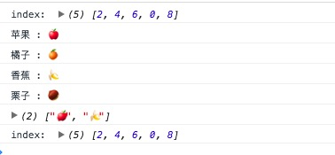

简介：

*filter* `_.filter(obj, predicate, context)` Alias: *select*
在obj中逐项查找，返回满足predicate中条件的值组成的数组（新的数组）。

源码：

```js

// Return all the elements that pass a truth test.
// Aliased as `select`.
_.filter = _.select = function(obj, predicate, context) {
  var results = [];
  predicate = cb(predicate, context);
  _.each(obj, function(value, index, list) {
    if (predicate(value, index, list)) results.push(value);
  });
  return results;
};

```

使用：

```js
(function(){

    console.log('index: ',_.filter([1,2,-1,3,4,5,6,0,7,8,],(item,index,arr) => {
        return item % 2 == 0;
    }))

    console.log(_.filter({'苹果':'🍎','橘子':'🍊','香蕉':'🍌','栗子':'🌰'},(item,key,obj) => {  //
        console.log(key,':',item);
        return item == '🍌' || item == '🍎' ;
    }));

    console.log('index: ',_.select([1,2,-1,3,4,5,6,0,7,8,],(item,index,arr) => {
        return item % 2 == 0;
    }))

})()

```

result:


