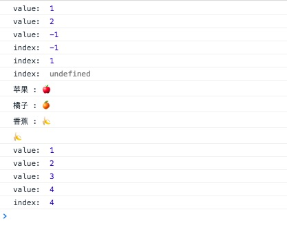

简介：

*find* `_.find(obj, predicate, [context])` Alias: *detect*
在obj中逐项查找，返回第一个通过predicate迭代函数真值检测的元素值，如果没有值传递给测试迭代器将返回undefined。 如果找到匹配的元素，函数将立即返回，不会遍历整个obj。

from：[@愚人码头](http://www.css88.com/doc/underscore1.8.2/#find)

源码：

```js

// Return the first value which passes a truth test. Aliased as `detect`.
_.find = _.detect = function(obj, predicate, context) {
  var key;
  if (isArrayLike(obj)) {
    key = _.findIndex(obj, predicate, context);
  } else {
    key = _.findKey(obj, predicate, context);
  }
  if (key !== void 0 && key !== -1) return obj[key];
};

```

使用：

```js
(function(){

    console.log('index: ',_.find([1,2,-1,3,4,5,6,0,7,8,],(item,index,arr) => {
        console.log('value: ',item);
        return item == -1;
    }))

    console.log('index: ',_.find([1,2,3,4,5,6,0,7,8,],(i) => {
        return i % 4 == 1;
    }));

    console.log('index: ',_.find([1,2,3,4,5,6,0,7,8,],(i) => {
        return i > 10;
    }));


    console.log(_.find({'苹果':'🍎','橘子':'🍊','香蕉':'🍌','栗子':'🌰'},(item,key,obj) => {  //
        console.log(key,':',item);
        return item == '🍌';
    }));

    console.log('index: ',_.detect([1,2,3,4,5,6,0,7,8,],(i) => {
        console.log('value: ',i);
        return i == 4;
    }))

})()

```

result:



方法分析：

`findIndex` findIndex函数被赋值为 `createPredicateIndexFinder(dir)` 。createPredicateIndexFinder是行数生成器，生成findIndex和findLastIndex函数。`var index = dir > 0 ? 0 : length - 1;` 根据dir参数来判断循环执行顺序。当匹配到值，返回其index,否则返回 -1。

```js
// Generator function to create the findIndex and findLastIndex functions
function createPredicateIndexFinder(dir) {
  return function(array, predicate, context) {
    predicate = cb(predicate, context);
    var length = getLength(array);
    var index = dir > 0 ? 0 : length - 1;  //dir 判断循环顺序
    for (; index >= 0 && index < length; index += dir) {
      if (predicate(array[index], index, array)) return index;
    }
    return -1;
  };
}
// Returns the first index on an array-like that passes a predicate test
_.findIndex = createPredicateIndexFinder(1);

```

`findKey` findKey函数只要是针对Object对象，当匹配到值，返回其key,否则没有返回值

```js

// Returns the first key on an object that passes a predicate test
_.findKey = function(obj, predicate, context) {
  predicate = cb(predicate, context);
  var keys = _.keys(obj), key;
  for (var i = 0, length = keys.length; i < length; i++) {
    key = keys[i];
    if (predicate(obj[key], key, obj)) return key;
  }
};

```
