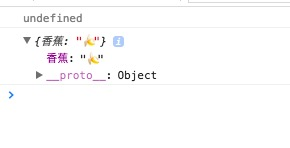

简介：

*findWhere* `_.findWhere(obj, attrs) `
遍历整个obj数组，返回匹配attrs参数所列出的键／值对的第一个值。
如果没有找到匹配的属性，或者obj是空的，那么将返回undefined。

源码：

```js

// Convenience version of a common use case of `find`: getting the first object
// containing specific `key:value` pairs.
_.findWhere = function(obj, attrs) {
  return _.find(obj, _.matcher(attrs));
};

```

使用：

```js
(function(){

    console.log(_.findWhere([{'苹果':'🍎'},{'橘子':'🍊'},{'栗子':'🌰'}],{'香蕉':'🍌'}));
    console.log(_.findWhere([{'苹果':'🍎'},{'橘子':'🍊'},{'香蕉':'🍌'},{'香蕉':'🍌','栗子':'🌰'}],{'香蕉':'🍌'}));

})()

```

result:



方法分析：

[_.find](../find)

[_.matcher(attrs)](../../Objects/matcher)
