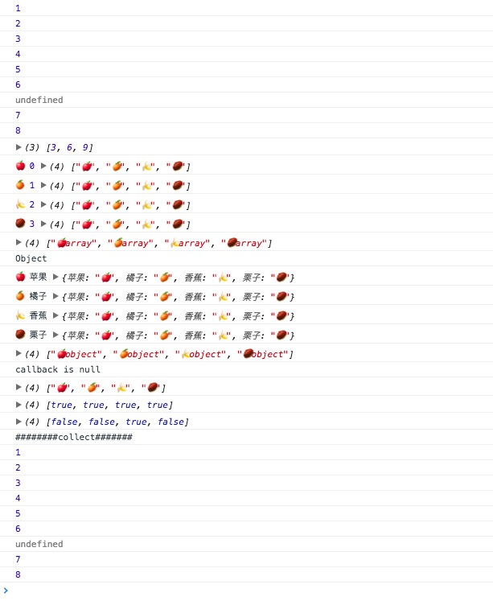

简介：

*map* `_.map(obj, iteratee, [context])` Alias: *collect*
通过转换函数(iteratee迭代器)映射列表中的每个值产生价值的新数组。iteratee传递三个参数：value，然后是迭代 index(或 key ,如果obj是个JavaScript对象是，这个参数就是key)，最后一个是引用指向整个obj。


from：[@愚人码头](http://www.css88.com/doc/underscore1.8.2/#map)

(略有修改)

源码：

```js
// Return the results of applying the iteratee to each element.
_.map = _.collect = function(obj, iteratee, context) {
  iteratee = cb(iteratee, context);
  var keys = !isArrayLike(obj) && _.keys(obj),
      length = (keys || obj).length,
      results = Array(length);
  for (var index = 0; index < length; index++) {
    var currentKey = keys ? keys[index] : index;
    results[index] = iteratee(obj[currentKey], currentKey, obj);
  }
  return results;
};

```


使用：

```js

(function(){

    _.map([1,2,3,4,5,6,,7,8,],(i) => {
        console.log(i);
    })
    console.log(_.map([1, 2, 3], (num) =>  num * 3));


    console.log(
        _.map(['🍎', '🍊', '🍌', '🌰'], (val,index,obj) => {
            console.log(val,index,obj);
            return val + 'array'
        })
    );

    console.log("Object");
    console.log(
        _.map({'苹果':'🍎','橘子':'🍊','香蕉':'🍌','栗子':'🌰'},(val,key,obj) => {
            console.log(val,key,obj);

            return val + 'object'
        })
    );
    console.log('callback is null');
    console.log(
        _.map({'苹果':'🍎','橘子':'🍊','香蕉':'🍌','栗子':'🌰'})
    );
    console.log(
        _.map({'苹果':'🍎','橘子':'🍊','香蕉':'🍌','栗子':'🌰'},{})
    );
    console.log(
        _.map({'1':{'苹果':'1'},'2':{'橘子':'2'},'3':{'香蕉':'3'},'4':{'栗子':'4'}},{'香蕉':'3'})
    );

    console.log('########collect#######');
    _.collect([1,2,3,4,5,6,,7,8,],(i) => {
        console.log(i);
    })
})()

```

result:




方法分析：

`cb` 一个主要的内部函数生成回调函数，可以应用到每个元素的集合，返回预期的结果或identity，任意一个回调，一个属性或属性访问器。
```js
// A mostly-internal function to generate callbacks that can be applied
// to each element in a collection, returning the desired result — either
// identity, an arbitrary callback, a property matcher, or a property accessor.
var cb = function(value, context, argCount) {
  if (value == null) return _.identity;
  if (_.isFunction(value)) return optimizeCb(value, context, argCount);
  if (_.isObject(value)) return _.matcher(value);
  return _.property(value);
};

```

注： each只是遍历，map通过遍历返回一个新的值
