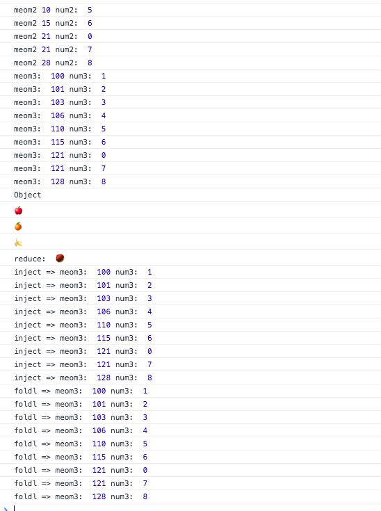

简介：

*reduce* `_.reduce(obj, iteratee, [memo],[context])` Aliases: *inject, foldl*
别名为 inject 和 foldl, reduce方法把obj中元素归结为一个单独的数值。memo是reduce函数的初始值，reduce的每一步都需要由iteratee返回。这个迭代传递4个参数：memo,value和迭代的index（或者 key）和最后一个引用的整个obj。(从一个值列表中生成一个结果)

如果没有memo传递给reduce的初始调用，iteratee不会被列表中的第一个元素调用。第一个元素将取代 传递给列表中下一个元素调用iteratee的memo参数。


from：[@愚人码头](http://www.css88.com/doc/underscore1.8.2/#reduce)

(略有修改)

源码：

```js
// Create a reducing function iterating left or right.
function createReduce(dir) {
  // Optimized iterator function as using arguments.length
  // in the main function will deoptimize the, see #1991.
  function iterator(obj, iteratee, memo, keys, index, length) {
    for (; index >= 0 && index < length; index += dir) {
      var currentKey = keys ? keys[index] : index;
      memo = iteratee(memo, obj[currentKey], currentKey, obj);
    }
    return memo;
  }

  return function(obj, iteratee, memo, context) {
    iteratee = optimizeCb(iteratee, context, 4);
    var keys = !isArrayLike(obj) && _.keys(obj),
        length = (keys || obj).length,
        index = dir > 0 ? 0 : length - 1;
    // Determine the initial value if none is provided.
    if (arguments.length < 3) {
      memo = obj[keys ? keys[index] : index];
      index += dir;
    }
    return iterator(obj, iteratee, memo, keys, index, length);
  };
}

// **Reduce** builds up a single result from a list of values, aka `inject`,
// or `foldl`.
_.reduce = _.foldl = _.inject = createReduce(1);

```


使用：

```js

(function(){

    // 第三个参数没有 memo默认为数组的第一个的值
    // 循环到第二次时，没有返回值 memo的值为undefined
    _.reduce([1,2,3,4,5,6,0,7,8,],(meom,num) => {
        console.log('meom1',meom,'num1: ',num);
    })

    _.reduce([1,2,3,4,5,6,0,7,8,],(meom,num) => {
        console.log('meom2',meom,'num2: ',num);
        return meom + num;
    })

    _.reduce([1,2,3,4,5,6,0,7,8],(meom,num) => {
        console.log('meom3: ',meom,'num3: ',num);
        return meom + num;
    },100)

    console.log("Object");

    _.reduce({'苹果':'🍎','橘子':'🍊','香蕉':'🍌','栗子':'🌰'},(memo,obj) => {
        console.log(memo);
        return obj;
    })

    console.log('reduce: ',_.reduce({'苹果':'🍎','橘子':'🍊','香蕉':'🍌','栗子':'🌰'},(memo,obj) => {
        return obj;
    }))


    _.inject([1,2,3,4,5,6,0,7,8],(meom,num) => {
        console.log('inject => meom3: ',meom,'num3: ',num);
        return meom + num;
    },100)

    _.foldl([1,2,3,4,5,6,0,7,8],(meom,num) => {
        console.log('foldl => meom3: ',meom,'num3: ',num);
        return meom + num;
    },100)
})()

```

result:




方法分析：

`createReduce` 创建一个reduce函数,迭代的顺序根据传入的参数来判断开始位置（左或右）。
```js
// Create a reducing function iterating left or right.
function createReduce(dir) {
    //...
}

```

注： 原生的 reduce 只用于数组，underscore 的 reduce 能用于 Object
