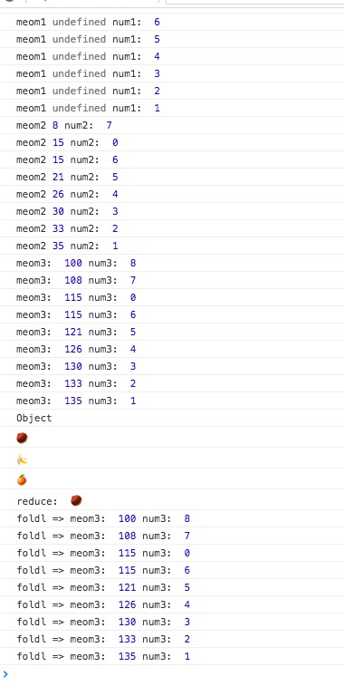

简介：

*reduceRight* `_.reduceRight(obj, iteratee, [memo], [context])` Aliases: *foldr*
别名为foldr, reduce方法把obj中元素归结为一个单独的数值。memo是reduce函数的初始值，reduceRight的每一步都需要由iteratee返回。这个迭代传递4个参数：memo,value和迭代的index（或者 key）和最后一个引用的整个obj。

如果没有memo传递给reduceRight的初始调用，最后一个元素将取代传递给列表中下一个元素调用iteratee的memo参数。

源码：

```js
// Create a reducing function iterating left or right.
function createReduce(dir) {
  // Optimized iterator function as using arguments.length
  // in the main function will deoptimize the, see #1991.
  function iterator(obj, iteratee, memo, keys, index, length) {
    for (; index >= 0 && index < length; index += dir) {
      var currentKey = keys ? keys[index] : index;
      memo = iteratee(memo, obj[currentKey], currentKey, obj);
    }
    return memo;
  }

  return function(obj, iteratee, memo, context) {
    iteratee = optimizeCb(iteratee, context, 4);
    var keys = !isArrayLike(obj) && _.keys(obj),
        length = (keys || obj).length,
        index = dir > 0 ? 0 : length - 1;
    // Determine the initial value if none is provided.
    if (arguments.length < 3) {
      memo = obj[keys ? keys[index] : index];
      index += dir;
    }
    return iterator(obj, iteratee, memo, keys, index, length);
  };
}

// The right-associative version of reduce, also known as `foldr`.
_.reduceRight = _.foldr = createReduce(-1);

```


使用：

```js

    (function(){

        // 第三个参数没有 memo默认为数组的最后一个的值
        // 循环到第二次时，没有返回值 memo的值为undefined
        _.reduceRight([1,2,3,4,5,6,0,7,8,],(meom,num) => {
            console.log('meom1',meom,'num1: ',num);
        })

        _.reduceRight([1,2,3,4,5,6,0,7,8,],(meom,num) => {
            console.log('meom2',meom,'num2: ',num);
            return meom + num;
        })

        _.reduceRight([1,2,3,4,5,6,0,7,8],(meom,num) => {
            console.log('meom3: ',meom,'num3: ',num);
            return meom + num;
        },100)

        console.log("Object");

        _.reduceRight({'苹果':'🍎','橘子':'🍊','香蕉':'🍌','栗子':'🌰'},(memo,obj) => {
            console.log(memo);
            return obj;
        })

        console.log('reduce: ',_.reduce({'苹果':'🍎','橘子':'🍊','香蕉':'🍌','栗子':'🌰'},(memo,obj) => {
            return obj;
        }))

        _.foldr([1,2,3,4,5,6,0,7,8],(meom,num) => {
            console.log('foldl => meom3: ',meom,'num3: ',num);
            return meom + num;
        },100)
    })()

```

result:




如果有问题请查看[reduce](../reduce)
