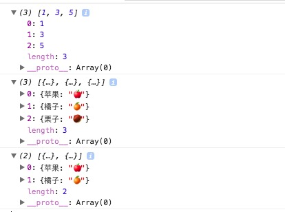

简介：

*reject* `_.reject(obj, attrs) `
返回obj中没有通过attrs真值检测的元素集合，与filter相反。

源码：

```js

// Return all the elements for which a truth test fails.
_.reject = function(obj, predicate, context) {
  return _.filter(obj, _.negate(cb(predicate)), context);
};
```

使用：

```js
(function(){
    var odds = _.reject([1, 2, 3, 4, 5, 6], function(num){ return num % 2 == 0; });
    console.log(odds);
    console.log(_.reject([{'苹果':'🍎'},{'橘子':'🍊'},{'栗子':'🌰'}],{'香蕉':'🍌'}));
    console.log(_.reject([{'苹果':'🍎'},{'橘子':'🍊'},{'香蕉':'🍌'},{'香蕉':'🍌','栗子':'🌰'}],{'香蕉':'🍌'}));

})()

```

result:



方法分析：

[_.filter](../filter)

[_.negate(cb(predicate)), context)](../../Functions/negate)
