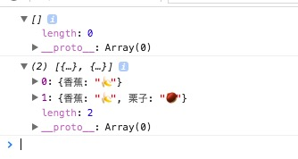

简介：

*where* `_.where(obj, attrs) `


源码：

```js

// Convenience version of a common use case of `filter`: selecting only objects
// containing specific `key:value` pairs.
_.where = function(obj, attrs) {
  return _.filter(obj, _.matcher(attrs));
};

```

使用：

```js


```

result:



方法分析：

[filter](../filter)
