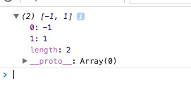

简介：

*negate* `_.negate(predicate) `
返回一个反面的版本的predicate函数。

源码：

```js

// Convenience version of a common use case of `find`: getting the first object
// Returns a negated version of the passed-in predicate.
_.negate = function(predicate) {
  return function() {
    return !predicate.apply(this, arguments);
  };
};
```

使用：

```js
(function(){

    var isFalsy = _.negate(function(item){
        if(item % 2 ==0) return true;
        return false;
    });
    console.log(_.filter([-2, -1, 0, 1, 2], isFalsy)); //[-1,1]

})()

```

result:



方法分析：

[apply](https://developer.mozilla.org/zh-CN/docs/Web/JavaScript/Reference/Global_Objects/Function/apply)
