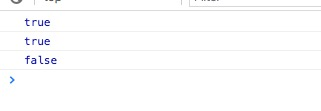

简介：

*isMatch* `_.isMatch(object, attrs)`
判断attrs中的key/value是否包含在objec中(attrs的键／值都在object对象中,)。当两个参数都不存在时，返回true

源码：

```js
// Returns whether an object has a given set of `key:value` pairs.
_.isMatch = function(object, attrs) {
  var keys = _.keys(attrs), length = keys.length;
  if (object == null) return !length;  //当两个参数都不纯在时，返回true
  var obj = Object(object);
  for (var i = 0; i < length; i++) {
    var key = keys[i];
    if (attrs[key] !== obj[key] || !(key in obj)) return false;
  }
  return true;
};

```

使用：

```js
(function(){

    console.log(_.isMatch()); // true

    console.log(_.isMatch({'苹果':'🍎','橘子':'🍊','香蕉':'🍌','栗子':'🌰'},{'香蕉':'🍌','栗子':'🌰'})); //true

    console.log(_.isMatch({'苹果':'🍎','橘子':'🍊','香蕉':'🍌','栗子':'🌰'},{'香':'🍌','栗子':'🌰'})); //false

})()

```

result:



方法分析：

获取对象都键值，并组成数组

[_.keys(attrs)](../Objects/keys)
