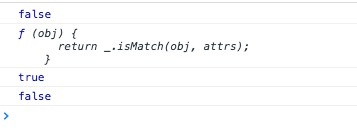

简介：

*matcher* `_.matcher(attrs)` Alias: *matches*
返回一个断言函数，用于检查对象是否有一组给定的“键/值”对

源码：

```js

// Returns a predicate for checking whether an object has a given set of
// `key:value` pairs.
_.matcher = _.matches = function(attrs) {
  attrs = _.extendOwn({}, attrs);
  return function(obj) {
    return _.isMatch(obj, attrs);
  };
};

```

使用：

```js
(function(){
    var ready = _.matcher({selected: true, visible: true});

    console.log(ready({visible: true})); //false

    console.log(_.matcher());

    var ready1= _.matcher({'香蕉':'🍌','栗子':'🌰'})
    console.log(ready1({'苹果':'🍎','橘子':'🍊','香蕉':'🍌','栗子':'🌰'})); //true

    var ready2= _.matcher({'香':'🍌','栗子':'🌰'})
    console.log(ready2({'苹果':'🍎','橘子':'🍊','香蕉':'🍌','栗子':'🌰'})); //false

})()

```

result:



方法分析：

[_.extendOwn({}, attrs)](../extendOwn)

[_.isMatch(obj, attrs)](../isMatch)
